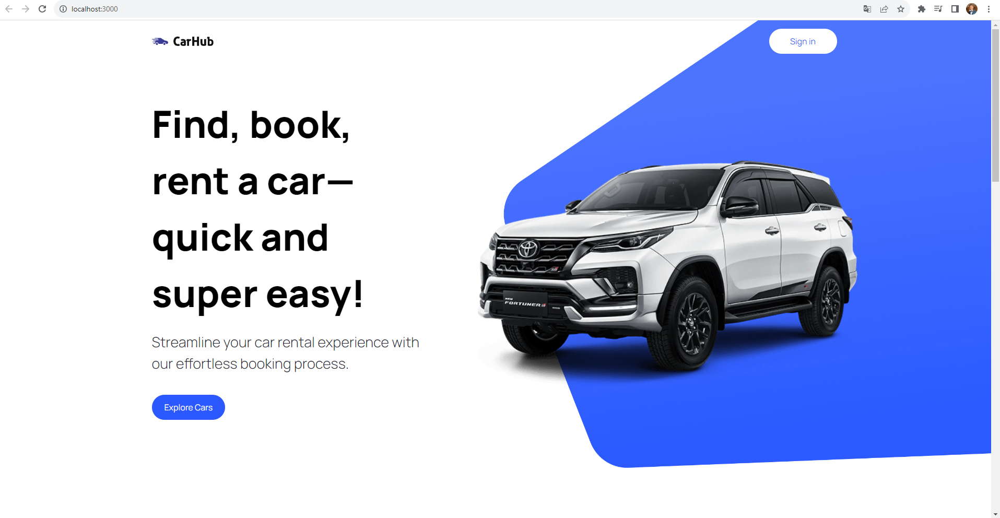

# my-car
J'ai développé my-car, une application de location de voitures utilisant Next.js, React, TypeScript et Tailwind CSS.
Elle propose une expérience de réservation fluide avec des cartes détaillées pour simplifier la sélection des véhicules. 
Avec une interface réactive et un design moderne, my-car vise à offrir une expérience de location intuitive et efficace, redéfinissant ainsi les services de location de voitures.

[English]

I developed my-car, a car rental application using Next.js, React, TypeScript, and Tailwind CSS. 
It offers a seamless booking experience with detailed maps to simplify vehicle selection. 
With a responsive interface and modern design, my-car aims to provide an intuitive and efficient rental experience, redefining car rental services.

